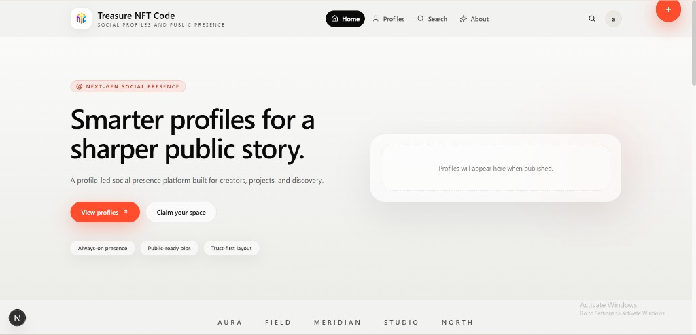
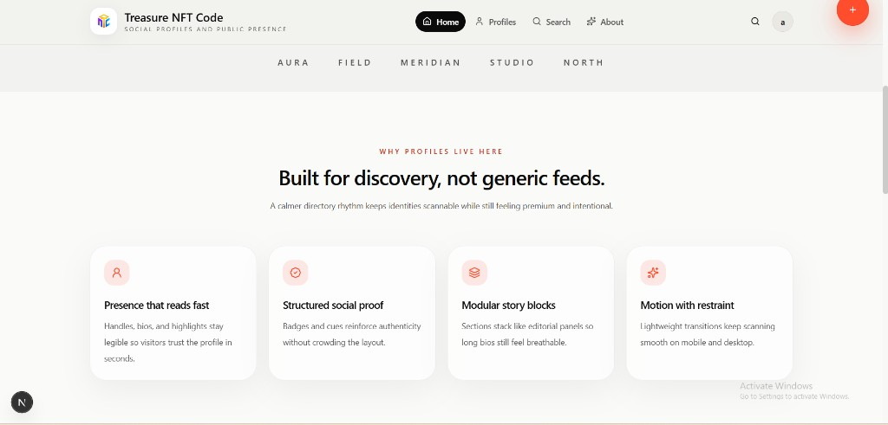
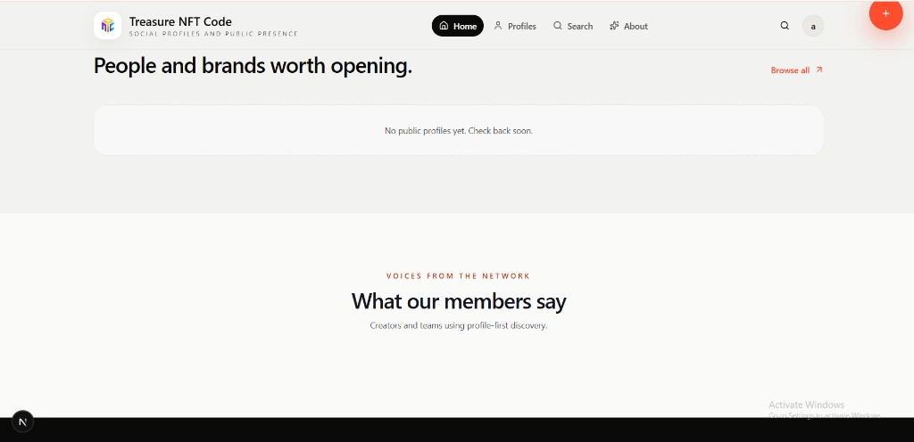
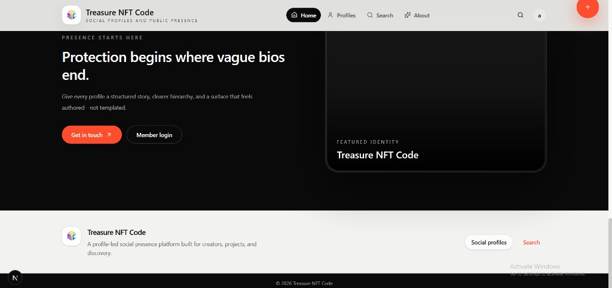
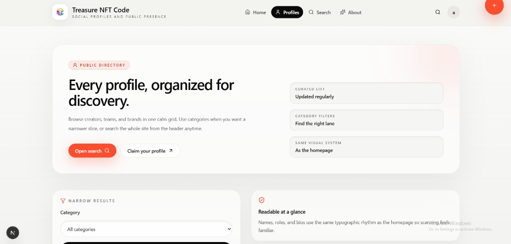
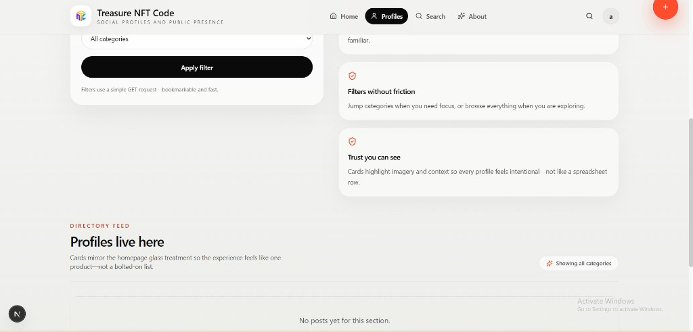
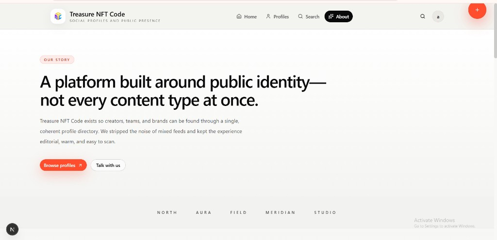

# Treasure NFT Code

Profile-led social presence site built with Next.js. Below are **UI screenshots** from the current interface (embedded from this repo so they render on GitHub).

---

## Home

### Hero

### Features (“Why profiles live here”)

### Directory & testimonials

### Dark CTA band

---

## Profiles

### Directory hero

### Filters & feed

---

## About

---

## Assets

Screenshots live under [`docs/readme-screenshots/`](docs/readme-screenshots/). Commit and push this folder with `README.md` so GitHub can resolve the relative image paths.

For deployment notes, see [`deploy/README.md`](deploy/README.md).
